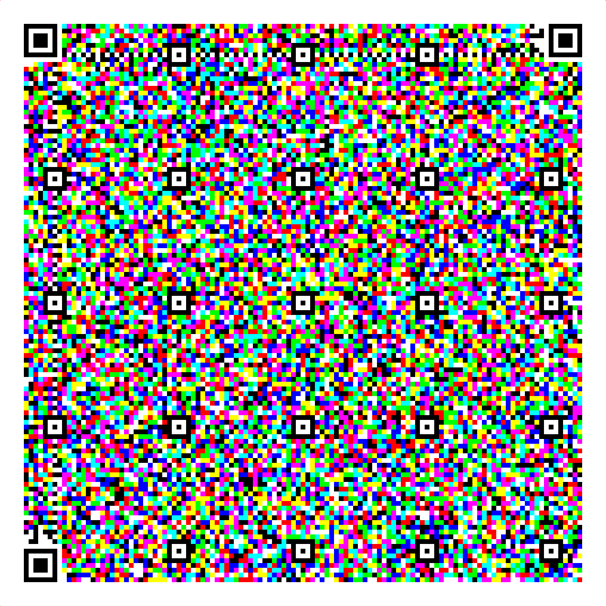
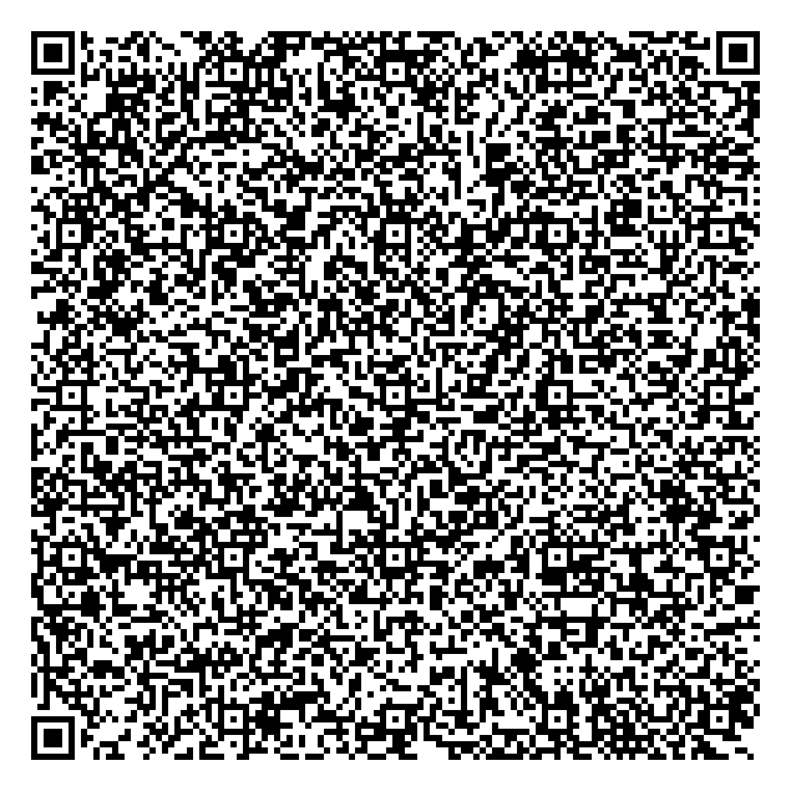
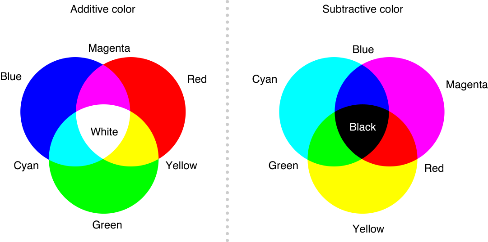
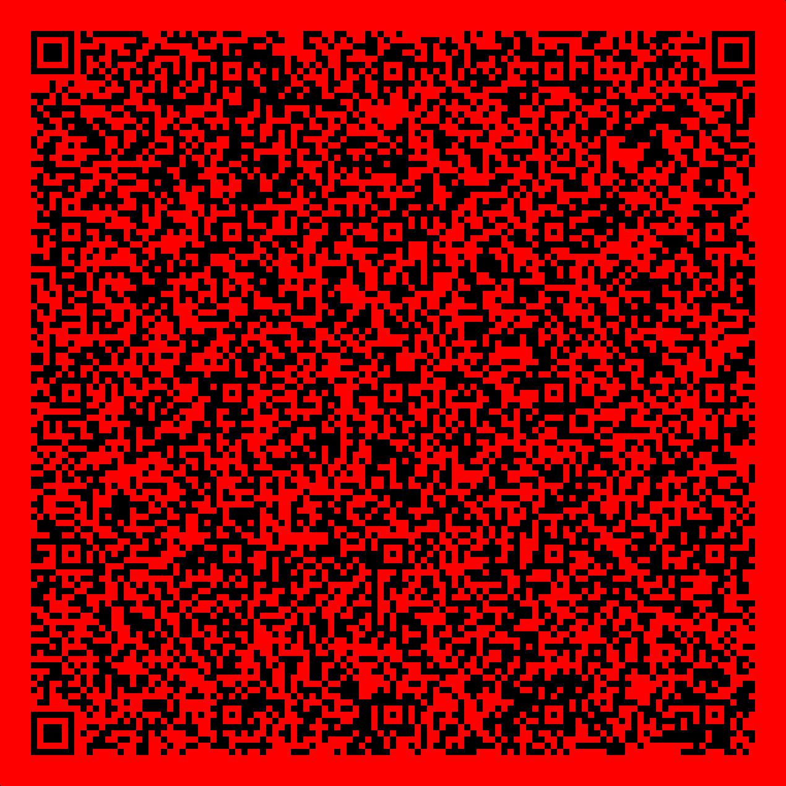
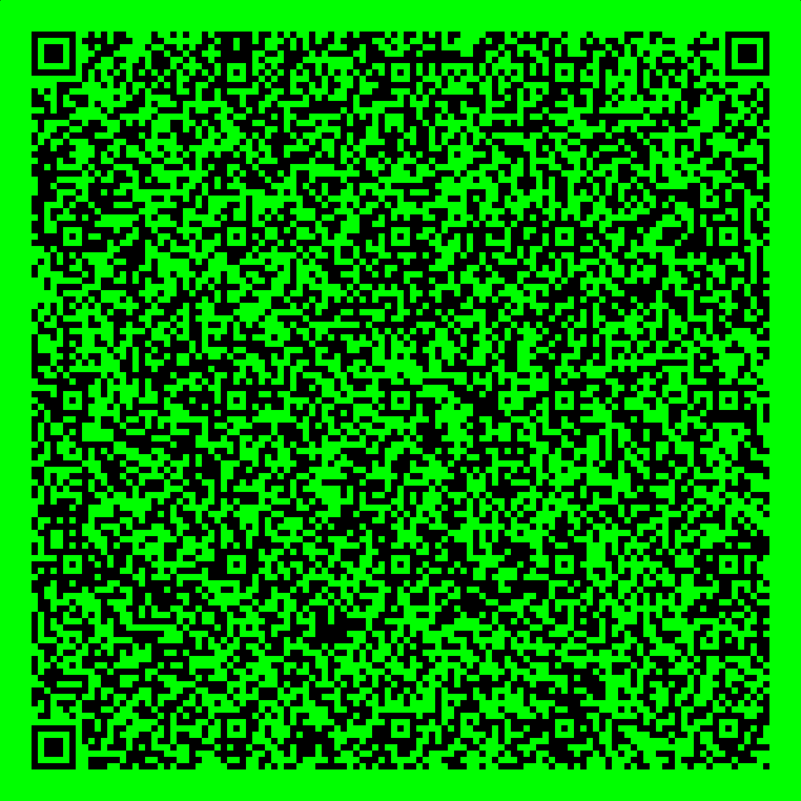
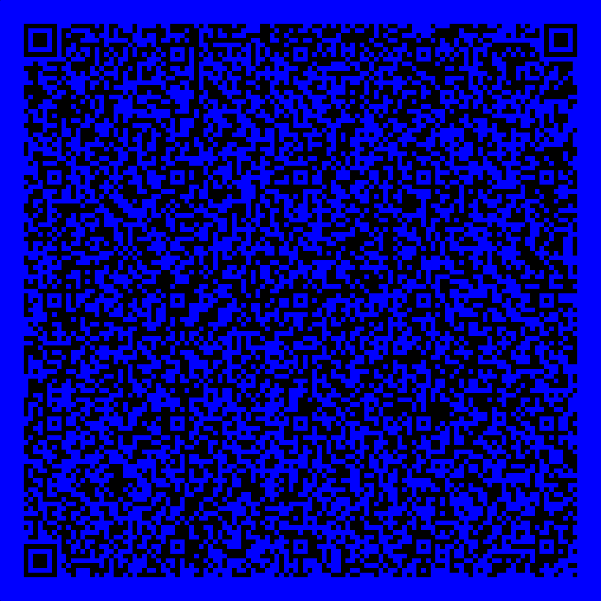

# Phantasmagoria

The given GIF files iterates over what seems to be a QR code.<br>
However, when we extract frames from this GIF file, we realise exactly half frames are black and white and half are colored.

Frames can be generated with ```frame_from_gif.py``` <br>
```py
from PIL import Image

def extract_frames(gif_path, output_folder):
    with Image.open(gif_path) as img:
        # Iterate through each frame
        for frame in range(img.n_frames):
            img.seek(frame)
            # Save each frame as a new image
            img.save(f"{output_folder}/{frame+1}.png")

# Specify the path to your GIF file
gif_path = "chal.gif"

# Specify the folder where you want to save the extracted frames
output_folder = "gif_frame"

extract_frames(gif_path, output_folder)
```
Total 200 frames are present (starting 1.png) of which the odd ones are black and white, while even ones are colored. From the frames, it is quite evident that they form two separate QR codes (100 frames each), that is, 10x10 frames.

The script ```qr_from_frames.py``` will make required odd and even frame QRs.<br>
```py
from PIL import Image
import os

# Directory containing the PNG files
directory = "gif_frame"

even_files = []
odd_files = []

files = sorted(os.listdir(directory), key=lambda x: int(os.path.splitext(x)[0]))
for filename in files:
    if filename.endswith(".png"):
        file_number = int(os.path.splitext(filename)[0])
        if file_number % 2 == 0:
            even_files.append(os.path.join(directory, filename))
        else:
            odd_files.append(os.path.join(directory, filename))

# Function to create a big image from a list of image files
def create_big_image(image_files, output_filename):
    images = [Image.open(img) for img in image_files]

    image_width, image_height = images[0].size

    big_image = Image.new("RGB", (image_width * 10, image_height * 10))

    for i in range(10):
        for j in range(10):
            index = i * 10 + j
            big_image.paste(images[index], (j * image_width, i * image_height))

    big_image.save(output_filename)

create_big_image(even_files, "even_qr.png")
create_big_image(odd_files, "odd_qr.png")

```

They look as follows:<br>
even_qr.png<br>


odd_qr.png<br>


Scanning the coloured QR doesn't directly lead to anything, and the black and white one leads to lyrics of one of our beloved songs.

Refer: https://hackaday.io/project/192082-rectangular-micro-qr-code-rmqr



We can eliminate colors by applying red, green, and blue planes on the image and get 3 different QR codes.

I used https://stegonline.georgeom.net/upload to do so

    

which respectively give e, n, c for RSA.


These can be cracked using ```decrypt.py```

```py
import owiener # https://github.com/orisano/owiener/blob/master/owiener.py
from Crypto.Util.number import long_to_bytes

e = 580107295407929983455474259123048958892268616065202610504097478704300124688755104518843786843320420594328180667097651308831224484345522788974595814072054519017036375295283346355248179858634315967974862898808223500971903823682739564989144161533670334282168903963815530341737627355737754279837367500836251818257011349990096996208188583942365085839848233828296376979143808880317533866787720420277343358834561294167770535918326741342201019483634741886264335838390481475273985184921917334302415384882333709406390155772477875038574493991862714614995400554302836808307148531462169082270581410355365459689979718410594946465757345418167500441759086471705367181923686763503684027485517203432506707344347783693800292516556903295589747181683464968271679813556995850747615373120820875968987307345135528514167832232730587801941826874478866266248104183762332450746296192019414713597801306568432969966780462547060873090168456225293338399628593451782650498742449891396155749182822135489206945557245425857310335962454516172608455034226164240182895467945937699668831887344790952929260964764874686656180773292544947330844662364326840643409486240155063338637903846556007310024878543296033058049856666554133648498640712529858440916870291185920494704803143

n = 676791844642584980698053302310223785374313385409403045588113725155016812136880955271984417983873824026716210778280593193636428565069776587137028449750730272186542437844497237414456209835073368629304006715276260751133887794296529492487334855122615389995863721291118118732027231915027379993143595417642293787966513241655113162242886681266092600146489606133012439809001110360370456177919007156990233918640321509862398958571381198232567856064240532200641725144788895054486316049075570223352817949029389327640788515067890854211670242990506500384161300646686642943025006620039197262649011645414593036304976338145694104210102443351633126298836188101611468727285524121350542326419652662876739876424845347479917953656717595927494531015461852178181228442298434483771040709741405863344788052581819778178386583342583162229291454214612057110480344851213811069677642675472810388144418347604660534845766311357971367827288922569847511151214222283088837375795803519692209817560935544948763568461379169948048755718648569869223176458921320498263580169173526435342144022663119655800743047260437276330638259847190731172746917271144508137645140847075476659515891899224768333964574305422773267597098695989323996565887847836862251898531683849611661559455231

c = 544342977532404237408772156018844280042896018581454027178213021966933179442845437798554673545620437077690160719361782366496084247799878518975715150796511397840519300211970113174385006721394626735058682356052519383771627256690815712967712491626102749570315765793607724436304925195447530638210491706318962714162678496224311664384796373433133484652485030434903014477989234639514499007880766266336487828650563294477369869284464009446027489791555956252580321314582911124874488376100440106092810747363952104507525352045668294528122872841750097177464905666071617876996930044144939116978812626955932102034257961709955290700427646253669485222926458797085660621146417897771007300680609504190057013973071878997514930801531407454022185046675516302040705165530852907708234116394362314177321060017882453944778571652891878787594756953941882037855500075620246192415211529447574738034705454952785438018144229155984327393211236378437222298093295385097467084627926991924915499333729453319553497885055095056469836597798913831551134953389760004832277777103218600963483821015591765052538315472933051886240356519093653467540608074668757871161552736235872811563026735761624551483971176815836236188425184614789972749058974348218017069740385931961400851689995

d = owiener.attack(e, n)
pt = long_to_bytes(pow(c, d, n))
print (pt)
```
We get the flag.
## Flag: nite{71m3_70_fr4m3_7h15_c0l0urful_e_n_c_0d3d_qr}